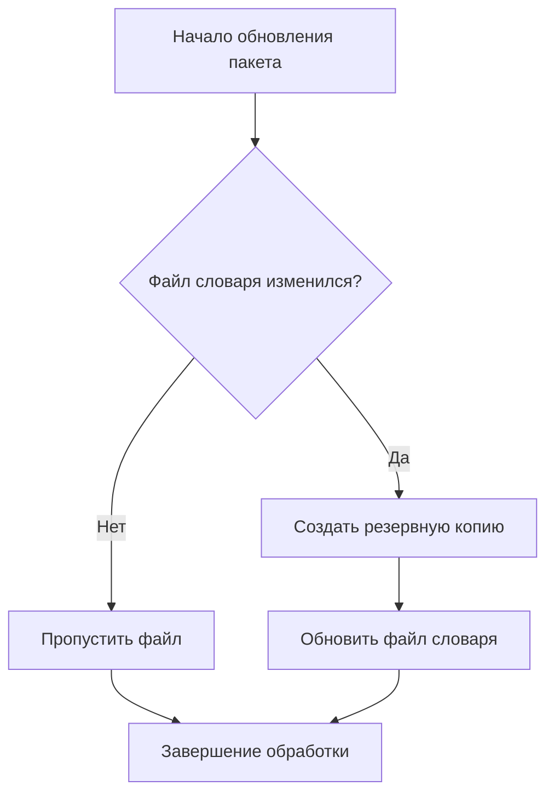

# Russian Bad Words Validator (cловарь и валидация плохих русских слов для сайта на PHP)

## Что это и для чего?
Пакет предоставляет два типа словарей для валидации пользовательского контента:

1. **StopWordsValidator** - проверяет на наличие стоп-слов, которые могут привести к блокировке Роскомнадзора:
    - Запрещённые товары (электроудочки, наркотические вещества)
    - Нежелательные услуги (гадания, эскорт-услуги, кредиты)
    - Другие проблемные категории

2. **ProfanityWordsValidator** - проверяет на ненормативную лексику (матерные слова)

Особенности:
- Структурированные PHP-массивы для удобного редактирования
- Регулярно обновляется на основе реальных случаев блокировок
- Защита от блокировок РКН
- Поддержка расширения и модификации


## Установка

### 1. Добавьте/измените секции `require`, `scripts` и `autoload` в `composer.json` вашего проекта:

```json
{
    "require": {
        "krugozor/russian-bad-words": "^1.0"
    },

    "scripts": {
        "post-install-cmd": [
            "Krugozor\\RussianBadWords\\Installer::postInstall"
        ],
        "post-update-cmd": [
            "Krugozor\\RussianBadWords\\Installer::postInstall"
        ],
        "pre-package-uninstall": [
            "Krugozor\\RussianBadWords\\Installer::preUninstall"
        ]
    },

    "autoload": {
        "psr-4": {
            "Krugozor\\RussianBadWords\\Items\\": "dictionaries"
        }
    }
}
```

### 2. Установите пакет
```bash
composer require krugozor/russian-bad-words
```

### 3. Проверьте установку
После установки в корне вашего проекта появится папка `dictionaries` с файлами:
- `ProfanityWordsValidator.php` - Словарь ненормативной лексики
- `StopWordsValidator.php` - Словарь стоп-слов

## Использование
Пример валидации текста (после установки пакета находится в директории `vendor/krugozor/russian-bad-words/console/sample.php`):

```php
<?php

require __DIR__ . '/../../../autoload.php';

// Данный пример запускать после установки пакета!

// Проверка сообщения от пользователя.
// В слове "электрo-фишер" кириллическая буква "о" заменена на латинскую,
// а слова умышленно соединены различными символами с целью обмана программы.
$message = 'Продам_электрo-фишер.fisher-f-3500 не дорого! Ну и немного нембутала';

$validator = new Krugozor\RussianBadWords\Items\StopWordsValidator($message);
if (!$validator->validate()) {
    echo "Текст не проходит валидацию! Плохие слова:\n";
    print_r($validator->getFailedWords());
}
```
Запуск:
```bash
 php vendor/krugozor/russian-bad-words/console/sample.php
```
Результат:
```
Текст не проходит валидацию! Плохие слова:
Array
(
    [1] => электрo-фишер
    [2] => fisher-f-3500
    [9] => нембутала
)
```

## Принцип работы резервных копий

При обновлении пакета система автоматически создает резервные копии измененных файлов словарей по следующему алгоритму:


[Данный словарь предназначен для веб-мастеров, которе обслуживают информационные системы,
контент которых наполняют пользователи - доски объявлений, форумы, функционал комментариев.

Данный словарь НЕ содержит ненормативную лексику (словарь ненормативной лексики
[есть тут](https://github.com/bars38/Russian_ban_words)), здесь представлены, в том числе, и слова,
за которые вы легко можете попасть под блокировку Роскомнадзором, если сообщение от пользователя,
содержащее слова из этого набора, окажутся на вашем сайте (например, объявление о продаже `электроудочки` или
препаратов, которые употребляют наркоманы - это реальные случаи из моей практики,
когда мне прилетали запросы от РКН).
Кроме того, словарь содержит набор стоп-слов, которые заведомо будут носить негативный характер,
например: `гадалка`, `эскорт`, `кредит` и т.д.

Словарь представлен в виде структурированного массива в формате PHP и это важно - владелец сайта
НЕ ДОЛЖЕН полагаться на базу стоп-слов, в которой слова находятся в хаотическом порядке,
***должна быть возможность в любой момент дописать или перепроверить содержимое словаря***, поэтому -
никаких данных в формате JSON или в виде SQL-дампа (это дружеский совет и напутствие возможным
контрибьютерам).

### Дополнительное runtime-решение на PHP

В одном из своих проектов я сделал дополнительную валидацию: я использую этот словарь и, во время
валидации сообщения от пользователя, преобразую в каждом слове из этого набора все буквы кириллицы
на латинские эквиваленты, что бы немного понимающий в IT пользователь всё-таки не разместил
негативное сообщение просто заменив "похожие" буквы.

Пример находится в файле [test.php](./console/test.php) и генерирует для
слова `наркотик` такой массив данных:

```text
Array
(
    [0] => нaркотик
    [1] => наркoтик
    [2] => нарkотик
    [3] => наркотиk
    [4] => наpкотик
    [5] => нapkoтиk
)
```

В [том же файле](./console/test.php) вы найдете пример готовой функции `validate` для работы с данным словарём.

Проверяйте поступающую от пользователя информацию и не допускайте на своём сайте сообщений,
благодаря которым ваш сайт может быть заблокирован.


