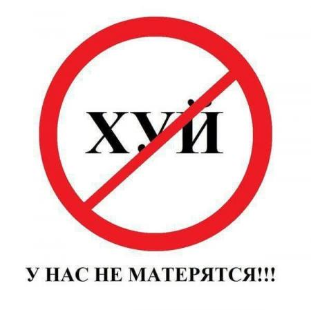

# Russian Bad Words



Версию 2.0 библиотеки доработала модель Claude Fable 5.1 от Anthropic в Claude Code.

Словари ненормативной лексики и стоп-слов для русскоязычного пользовательского контента и валидатор к ним:
доски объявлений, форумы, комментарии, чат-боты.

Проверка устроена просто: текст делится на слова, каждое слово ищется в словаре. Словари разделены
на уровни, чтобы проект сам выбирал строгость. Свои слова и исключения задаются в коде проекта
и не теряются при обновлении пакета.

## Установка

```bash
composer require krugozor/russian-bad-words
```

Нужен PHP 7.4 или новее и расширение mbstring. Дополнительных шагов нет: словари подключаются из пакета.

## Быстрый старт

```php
use Krugozor\RussianBadWords\BadWordsValidator;
use Krugozor\RussianBadWords\Dictionary;

$validator = new BadWordsValidator(Dictionary::profanity());

$result = $validator->check('Ну ты и cyka, блядь!');
$result->isClean(); // false
$result->words();   // ['блядь']  («cyka» это грубая лексика, а не мат: см. уровни словарей)
$result->mask();    // 'Ну ты и cyka, *****!'
```

## Словари

| Словарь | Что внутри | Когда включать |
|---|---|---|
| `Dictionary::profanity()` | Мат: хуй, пизда, ебать, блядь, залупа, мудак, манда, пидор, их производные и эвфемизмы. Около 2 000 словоформ | Всегда |
| `Dictionary::profanityRoots()` | Корни мата для поиска по вхождению: ловят словообразование, которого нет в словаре («хуяндексище», «ебанариум», «мудаковатость») | Когда важнее не пропустить, чем не ошибиться |
| `Dictionary::rude()` | Грубая, но не матерная лексика: говно, хрен, жопа, срать, дрочить, трахать, сука, шлюха. Около 400 слов | По политике площадки |
| `Dictionary::insults()` | Оскорбления без мата: дурак, лох, идиот, чмо, сволочь, тварь, гнида. Около 50 слов | По политике площадки |
| `Dictionary::anatomy()` | Анатомия, физиология и секс: анус, вагина, пенис, член, презерватив, минет. Около 60 слов | Детские и деловые площадки |
| `Dictionary::stopWords()` | Стоп-слова по темам, за которые площадку могут заблокировать | Доски объявлений, по категориям |

Словари объединяются:

```php
$dictionary = Dictionary::profanity()
    ->merge(Dictionary::profanityRoots())
    ->merge(Dictionary::rude(), Dictionary::insults());

$validator = new BadWordsValidator($dictionary);
```

Словари неизменяемы: каждая операция возвращает новый словарь, а встроенные словари кэшируются
в пределах процесса.

### Стоп-слова

Стоп-слова разбиты на категории, список даёт `Dictionary::stopWordCategories()`:

| Категория | Что внутри |
|---|---|
| `drugs` | Наркотики, жаргон, препараты |
| `weapons` | Оружие и средства самообороны |
| `extremism` | Экстремистские материалы и организации |
| `darknet` | Даркнет и названия площадок |
| `fishing` | Электроудочки и запрещённые орудия лова |
| `sex` | Интим-услуги, порнография, эскорт |
| `gambling` | Казино и азартные игры |
| `finance` | Кредиты, займы, обнал, криптовалюта, страховки |
| `fraud` | Спам, мошенничество, вредоносное ПО |
| `piracy` | Пиратство, взлом, торренты, обход блокировок |
| `documents` | Поддельные документы, дипломы и работы на заказ |
| `esoteric` | Магия, гадания, эзотерика |
| `tobacco` | Табак, вейпы, кальяны |
| `alcohol` | Алкоголь |
| `medical` | Рецептурные препараты, донорство |
| `suicide` | Суицид и эвтаназия |
| `violence` | Насилие |

```php
$validator = new BadWordsValidator(Dictionary::stopWords(['drugs', 'weapons', 'extremism']));
$validator = new BadWordsValidator(Dictionary::stopWords()); // все категории
```

Стоп-слова собраны по реальным случаям блокировок досок объявлений и содержат обычные слова:
«скачать», «кредит», «диплом», «video». Для форума или блога включайте только нужные категории.

## Свои слова и исключения

Слова проекта живут в коде проекта, а не в файлах пакета, поэтому обновление пакета их не затрагивает:

```php
$dictionary = Dictionary::profanity()
    ->with(['хуяндекс', 'айтиблядь'])   // добавить свои слова
    ->without(['хули']);                // убрать слово; оно также не будет находиться по корням
```

Удобно держать списки в конфигурации приложения, например в `config/badwords.php` для Laravel:

```php
return [
    'add' => ['хуяндекс'],
    'remove' => ['хули'],
];
```

```php
$dictionary = Dictionary::profanity()
    ->with(config('badwords.add'))
    ->without(config('badwords.remove'));
```

Свой словарь целиком: `Dictionary::fromWords([...])` или `Dictionary::fromFile('/path/to/words.php')`,
где файл возвращает список слов либо массив с ключами `words`, `roots` и `exceptions`, как
`data/profanity-roots.php`. Такой словарь объединяется с встроенными через `merge()`.

Общеизвестные и часто употребимые слова лучше присылать pull request-ом в файлы `data/`.

## Корни мата

`Dictionary::profanityRoots()` ищет корни по вхождению в слово: хуй, пизд, еб с известными приставками,
бляд, залуп, муд, манд, пидор, гандон, елд. Мат словообразовательно продуктивен («пиздоблядство»,
«залупоглазие», «хуепутало»), и перечислить все формы невозможно; корни закрывают этот хвост.

Корни дополняют словарь, а не заменяют его. Слово сначала ищется в словаре, и только если его там нет,
проверяется корнями. Словарь почти не даёт ложных срабатываний: каждое слово в него положено осознанно.
В нём же живут искажённые написания вроде «ипать» и «млять»: корень для них зацепил бы «липу» и «землю».
Для найденного по корню слова `Occurrence::word()` возвращает нормализованный фрагмент текста,
а не слово словаря, и `isByRoot()` отдаёт `true`. Так проект может точные совпадения блокировать
автоматически, а корневые отправлять на модерацию.

Корни проверены по списку из 1,5 млн русских словоформ
([russian-words](https://github.com/danakt/russian-words)): срабатывания вне мата устраняются
списком исключений («страху» защищает «застрахуй», «психу» защищает «психуй», «мандарин», «скипидар»
и другие). Ложные срабатывания всё же возможны, поэтому корни подключаются явно.

Свои корни и исключения: `withRoots(['^кор'])` и `withExceptions(['корень'])`. Корень записывается
как регулярное выражение без разделителей и флагов и применяется к слову в нижнем регистре
с «ё» → «е» и латинскими омоглифами, приведёнными к кириллице. Исключение записывается как подстрока
и приводится к тому же виду, что и слово. Корни объединяются в один шаблон группой со сбросом нумерации,
поэтому обратные ссылки и имена групп каждого корня остаются его собственными; набор корней, который
не компилируется вместе, отклоняется с `InvalidArgumentException`, а сбой PCRE при проверке даёт
`RuntimeException`, а не «чисто».

## Как ищутся слова

1. Текст делится на слова по любому символу, кроме букв, цифр, дефиса и «@». Слово с дефисом проверяется
   целиком, без дефисов и по частям: «электро-фишер», «хуй-ня», «сука-блядь». Совпавшая часть отмечается
   в своих границах: «сука-блядь» даёт два слова, «супер-хуйня» маскируется как «супер-*****». Точное
   совпадение на любом уровне важнее корневого, а корни сверяются сначала с частями. Слово с «@»
   проверяется целиком, где «@» читается как «а» («сук@», «г@ндон»), и по частям, где «@» разделитель
   адреса или упоминания: «хуй@mail.ru» маскируется как «***@mail.ru», «@хуйло» как «@*****».
2. Из слова удаляются невидимые форматирующие символы (мягкий перенос, пробел нулевой ширины)
   и диакритика; регистр приводится к нижнему, «ё» к «е». При наличии ext-intl выполняется нормализация
   NFKC: разложенные «й» и «ё» склеиваются, а полноширинные и математические буквы и лигатуры сводятся
   к обычным («ｃｙｋａ» → «cyka»). Без intl «й» и «ё» из двух знаков склеиваются сами.
3. Слово сравнивается со словарём в двух формах: в кириллице и в латинице по таблице похожих
   символов. Так ловятся любые подмены букв в обе стороны: «cyka», «xуйня», «pоrn», а также
   цифры и знаки вместо букв: «пи3да», «прое6ал», «д0лб0еб», «сук@». Два исключения, где кодов
   и аббревиатур больше, чем мата: слово словаря короче трёх букв («еб») и слово до трёх символов
   без единой кириллической буквы находятся только буква в букву. Иначе шахматный ход «e6»
   и коды вроде «Е6», «e6a», «4mo» считались бы матом. Со словарём корней такая латиница
   по-прежнему проверяется по корням.
4. Повторы букв схлопываются: «бляяяять», «сссука». Повтор из трёх и более букв сначала сводится
   к двум, чтобы находились слова с законным удвоением: «ахуеннно» → «ахуенно», «сссать» → «ссать».
5. Цифры по краям слова отбрасываются: «хуйня1», «12хуйня34». Оба написания, с цифрами и без,
   сначала ищутся в точном словаре и только потом по корням, поэтому «хуйня1» и с корнями остаётся
   точным «хуйня», а не корневым «хуйня1». Корневое слово сообщается без цифр: «хуепутало4» даёт
   «хуепутало». Исключение через `without()` действует и на такие написания: при исключённом
   «хуйня» чисты и «хуйня1», и «хуйняяя».
6. Слова не длиннее трёх букв, идущие подряд, проверяются склеенными, до двенадцати слов за раз:
   «с у к а», «х.у.й.н.я», «иди на х уй». Окно скользит по цепочке, поэтому слово на границе
   двенадцатого и тринадцатого коротких слов тоже собирается. Склеиваются слова, между которыми одни
   пробелы или одни знаки без пробелов; невидимые символы и диакритика в промежутке не в счёт.
   Перевод строки и знак препинания с пробелом («ел, да») разделяют предложение.
   Склейка сверяется только с точным словарём, без корней и без схлопывания повторов: иначе
   «её без» давало бы «ебез», а «у неё был» по корню с приставками давало бы «унеебыл».
   Склейка короче трёх букв не проверяется: инициалы «Е.Б.» не дают «еб». Слово с дефисом или «@»
   участвует в склейке своими частями: «иди-на-х-у-й» и «х-у-й-н-я-б-л-я-д-ь» находятся так же,
   как записанные через пробелы. Цепочка из одних обычных коротких слов русского языка не склеивается:
   «ел да», «иди от», «ах у ели», «сук и» это речь без запятой, а не разрядка. Список таких слов
   лежит в `data/short-words.php`. Цепочка из одиночных букв («с у к а») склеивается всегда,
   как и цепочка, где хотя бы одно слово не из списка («ху йня», «ах у е л и»).
7. Битый UTF-8 не роняет проверку: невалидные байты заменяются знаком «?».

## Результат проверки

```php
$result = $validator->check($text);

$result->isClean();      // bool
$result->words();        // найденные слова словаря без повторов: ['хуйня', 'блядь']
$result->mask('*');      // текст, где найденные слова заменены звёздочками по числу букв
$result->mask('@', 1, 1); // с открытыми буквами по краям: «хуй» станет «х@й», «блядь» станет «б@@@ь»
$result->occurrences();  // вхождения с позициями
$result->text();         // проверенный текст; смещения вхождений считаются по нему

foreach ($result->occurrences() as $occurrence) {
    $occurrence->fragment();  // как написал пользователь: «xуйня»
    $occurrence->word();      // слово словаря: «хуйня»; при совпадении по корню нормализованный фрагмент
    $occurrence->offset();    // смещение в байтах
    $occurrence->length();    // длина в байтах
    $occurrence->isByRoot();  // найдено по корню, а не по словарю
}
```

## Разработка

```bash
composer install
composer test      # PHPUnit
composer analyse   # PHPStan
php console/sample.php   # рабочий пример
```

Словари лежат в `data/`: один файл на уровень и на категорию стоп-слов, одна словоформа на строку,
нижний регистр, алфавитный порядок. Дубли через «ё» не нужны: при поиске «ё» приравнивается к «е».
Там же `short-words.php`, не словарь, а список обычных коротких слов русского языка для правила
склейки: цепочка из таких слов не склеивается в мат. Он сгруппирован по длине слова.
Тест `DataIntegrityTest` проверяет формат файлов и отсутствие пересечений между уровнями.
