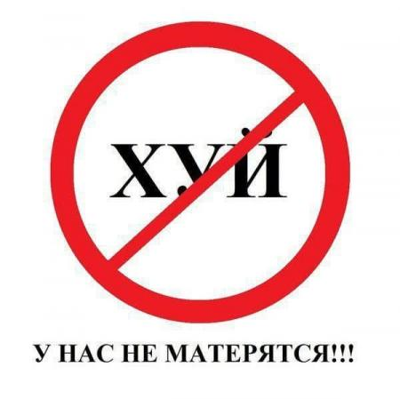

# Russian Bad Words Validator (cловарь и валидация плохих русских слов для сайта на PHP)



## Что это и для чего?
Пакет предоставляет два типа словарей для валидации пользовательского контента:

1. **StopWordsValidator** - проверяет на наличие стоп-слов, которые могут привести к блокировке Роскомнадзора:
    - Запрещённые товары (электроудочки, наркотические вещества)
    - Нежелательные услуги (гадания, эскорт-услуги, кредиты)
    - Другие проблемные категории

2. **ProfanityWordsValidator** - проверяет на ненормативную лексику (матерные слова)


Словарь предназначен для веб-мастеров, которе обслуживают информационные системы,
контент которых наполняют пользователи - доски объявлений, форумы, функционал комментариев.

Особенности:
- Структурированные PHP-массивы для удобного редактирования
- Регулярно обновляется на основе реальных случаев блокировок
- Поддержка расширения и модификации


## Установка

### 1. Добавьте/измените секции `require`, `scripts` и `autoload` в `composer.json` вашего проекта:

```json
{
    "require": {
        "krugozor/russian-bad-words": "^1.0"
    },

    "scripts": {
        "post-install-cmd": [
            "Krugozor\\RussianBadWords\\Installer::postInstall"
        ],
        "post-update-cmd": [
            "Krugozor\\RussianBadWords\\Installer::postInstall"
        ],
        "pre-package-uninstall": [
            "Krugozor\\RussianBadWords\\Installer::preUninstall"
        ]
    },

    "autoload": {
        "psr-4": {
            "Krugozor\\RussianBadWords\\Items\\": "dictionaries"
        }
    }
}
```

### 2. Установите пакет
```bash
composer require krugozor/russian-bad-words
```

### 3. Проверьте установку
После установки в корне вашего проекта появится папка `dictionaries` с файлами:
- `ProfanityWordsValidator.php` - Словарь ненормативной лексики
- `StopWordsValidator.php` - Словарь стоп-слов

**ВАЖНО:** Редактор PhpStorm иногда не видит только что созданную директорию `dictionaries`.
Смотрите факт её создания в проводнике.

## Использование
Пример валидации текста (данный пример после установки пакета находится в директории `vendor/krugozor/russian-bad-words/console/sample.php` и доступен для выполнения):

```php
<?php
// Проверка сообщения от пользователя.
// В слове "электрo-фишер" кириллическая буква "о" заменена на латинскую,
// а слова умышленно соединены различными символами с целью обмана программы.
// В слове "сукa" кириллическая буква "a" заменена на латинскую.
$message = 'Продам_электрo-фишер.fisher-f-3500 не дорого! Ну и немного нембутала, сукa';

$validator = new Krugozor\RussianBadWords\Items\StopWordsValidator($message);
if (!$validator->validate()) {
    echo "Текст не проходит валидацию! Плохие слова:\n";
    print_r($validator->getFailedWords());
}

$validator = new Krugozor\RussianBadWords\Items\ProfanityWordsValidator($message);
if (!$validator->validate()) {
    echo "Текст не проходит валидацию! Ненормативная лексика:\n";
    print_r($validator->getFailedWords());
}
```
Запуск:
```bash
 php vendor/krugozor/russian-bad-words/console/sample.php
```
Результат:
```
Текст не проходит валидацию! Плохие слова:
Array
(
    [1] => электрo-фишер
    [2] => fisher-f-3500
    [9] => нембутала
)

Текст не проходит валидацию! Ненормативная лексика:
Array
(
    [11] => сукa
)
```
Класс определяет слова, в которых русские буквы заменены на визуально похожие английские (например: «с» → «c», «а» → «a», «к» → «k»).

Пример работы для слова "сок" - будут найдены следующие варианты замен:
- **"cок"** (английская `c` вместо русской `с`)
- **"сok"** (английская `k` вместо русской `к`)

Данный подход позволяет системе выявлять запрещённые слова, даже если в них часть букв была заменена на схожие по начертанию английские символы.

## Принцип работы резервных копий

При обновлении пакета система автоматически создает резервные копии измененных файлов словарей по следующему алгоритму:


### Основные правила
1. Создание резервных копий происходит ТОЛЬКО при:
   - Наличии существующего файла словаря
   - Отличии содержимого нового файла от текущег
2. Формат имени резервного файла
`ГГГГ-ММ-ДД_ЧЧММСС_ИмяФайла.php`
   - Пример: `2025-08-08_153045_StopWordsValidator.php`
3. Расположение
   - Все резервные копии сохраняются в папке `dictionaries`

### Пример сценария
До обновления:
```
dictionaries/
├── StopWordsValidator.php (ваша версия)
└── ProfanityWordsValidator.php (версия из репозитория)
```

После обновления:
```
dictionaries/
├── StopWordsValidator.php (версия из репозитория)
├── 2025-08-08_153045_StopWordsValidator.php (ваша старая версия)
└── ProfanityWordsValidator.php (версия из репозитория)
```

### Управление резервными копиями
```bash
# Просмотр резервных копий
ls dictionaries/*.php

# Восстановление из резервной копии
cp dictionaries/2025-08-08_153045_StopWordsValidator.php dictionaries/StopWordsValidator.php
```
Важно: Система никогда не удаляет резервные копии автоматически

## Обновление словарей
Стандартное обновление из репозитория (с изменениями от автора пакета):
```bash
composer update krugozor/russian-bad-words
```
Принудительное обновление (с перезаписью ваших правок)
```bash
rm dictionaries/*
composer update krugozor/russian-bad-words
```

## Добавление своих слов
Откройте нужный файл словаря и добавьте слова в массив:
```php
// dictionaries/StopWordsValidator.php
return [
    // ...
    'электроудочка',
    'наркотик',
    'гадалка',
    // Добавьте свои слова здесь
    'новоезапрещенноеслово',
    'другоенедопустимоеслово',
];
```

Но лучше сделайте Merge request, если добавляете общеизвестные и частоупотребимые слова.

## Удаление пакета
```bash
composer remove krugozor/russian-bad-words
```
При удалении файлы словарей остаются в вашем проекте - защита от дурака.


